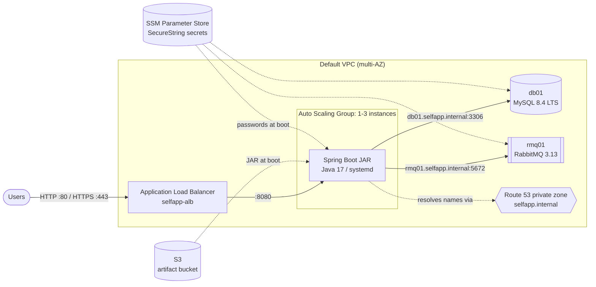

# aws lift-and-shift

> Rehosting a containerised Spring Boot app onto AWS EC2 using nothing but the AWS CLI and Bash.

[](https://github.com/alexiglesias/aws-lift-and-shift/actions/workflows/ci.yml)
[](https://aws.amazon.com/cli/)
[](#architecture)
[](https://www.gnu.org/software/bash/)
[](https://aws.amazon.com/linux/amazon-linux-2023/)
[](https://aws.amazon.com/corretto/)
[](https://www.mysql.com/)
[](https://www.rabbitmq.com/)
[](https://www.shellcheck.net/)
[](./LICENSE)

## What's in here

[selfapp-lite](https://github.com/alexiglesias/docker-buildlab-selfapp) runs locally as a Docker Compose stack (Spring Boot, MySQL, RabbitMQ, Nginx). This project migrates it to AWS with a **Lift & Shift (rehost)** strategy: each service moves to its own EC2 instance, unchanged, behind an Application Load Balancer, then the app tier is made self-healing with an Auto Scaling Group.

Every step is a numbered, re-runnable script. One command validates the whole deployment and another tears it all down.

## Prerequisites

> **Deploying needs an AWS account and creates billable resources**, roughly $0.10?~@~S0.15 per hour while the stack is up (see [Cost](#cost)). The offline tests (`bash tests/test.sh`) and CI need no AWS account at all.

- An AWS account and the [AWS CLI v2](https://docs.aws.amazon.com/cli/latest/userguide/getting-started-install.html), authenticated as an IAM user or role allowed to manage EC2, ELB, Auto Scaling, Route 53, S3, SSM and IAM (the scripts create a role and pass it to instances). A dedicated deploy user with its own CLI profile (`aws configure --profile selfapp`, then `export AWS_PROFILE=selfapp`) keeps this project separate from your other AWS work.
- Java 17 and Maven, to build the JAR.
- Bash: the stock macOS Bash 3.2 works, as does any Linux Bash.
- The app source, cloned next to this repo:

```
projects/
?~T~\?~T~@?~T~@ aws-lift-and-shift/        ?~F~P this repo
?~T~T?~T~@?~T~@ docker-buildlab-selfapp/   ?~F~P git clone https://github.com/alexiglesias/docker-buildlab-selfapp
```

## Architecture



Security groups are chained so each tier only accepts traffic from the tier in front of it:

```
Internet ──80/443──▶ selfapp-elb-sg ──8080──▶ selfapp-app-sg ──3306/5672──▶ selfapp-backend-sg
                                    SSH (22) only from YOUR_IP ──▶ app + backend
```

## Quick start

For a detailed walkthrough with expected output at every step, see [docs/DEPLOYMENT.md](docs/DEPLOYMENT.md).

**1. Configure.** Every script validates the config on startup and stops with a clear message if something is missing.

```bash
cp config.sh.example config.sh
# Set YOUR_IP, DB_PASS, DB_ROOT_PASS and RMQ_PASS. Generate passwords with:
openssl rand -base64 24 | tr -d '/+='
```

**2. Deploy.** This takes about 20–30 minutes; most of it is instances installing packages.

```bash
bash scripts/01-security-groups.sh   # key pair + 3 chained security groups
bash scripts/02-iam.sh               # secrets → SSM, least-privilege role + instance profile
bash scripts/03-backends.sh          # db01 (MySQL) + rmq01 (RabbitMQ)
bash scripts/04-route53.sh           # private DNS: db01/rmq01.selfapp.internal
bash scripts/05-deploy-app.sh        # build JAR → S3 → launch app01
bash scripts/06-alb.sh               # target group + ALB + listeners
bash scripts/08-validate.sh --wait   # rehost done: app01 serving behind the ALB
```

**3. Make it self-healing.** Move the app tier from one server to an Auto Scaling Group.

```bash
bash scripts/07-asg.sh               # launch template + ASG (min 1, max 3, CPU 70% target)
bash scripts/08-validate.sh --wait
# then retire app01 with the command 07-asg.sh prints
```

**4. Tear down.** Do this when you're done, to stop all charges.

```bash
bash scripts/99-teardown.sh
```

<!--
Screenshots go here after a live run, e.g.:


-->

## The scripts

| Script | What it does |
|---|---|
| `lib.sh` | Shared helpers sourced by every script: loads and validates config, defines resource names in one place, and wraps AWS lookups |
| `01-security-groups.sh` | Key pair and three security groups (ALB → app → backends) |
| `02-iam.sh` | Stores secrets as SSM SecureStrings; creates a role scoped to one bucket and one parameter path |
| `03-backends.sh` | Launches db01 and rmq01 with IMDSv2, the instance profile and tags |
| `04-route53.sh` | Private hosted zone and A records, waiting until DNS is live |
| `05-deploy-app.sh` | Builds the JAR, uploads it to a private S3 bucket, launches app01 |
| `06-alb.sh` | Target group (`/actuator/health`), multi-AZ ALB, listeners reconciled to config |
| `07-asg.sh` | Versioned launch template and ASG with target tracking; rolls out changes with an instance refresh |
| `08-validate.sh` | End-to-end checks with a CI-friendly exit code (details below) |
| `99-teardown.sh` | Deletes everything in dependency order; safe to re-run |

`08-validate.sh` checks that:
- every instance is running
- the DNS records match the current instance IPs
- no app or backend port is open to the internet
- the target group has at least one healthy target
- the app reports `UP` through the ALB, which proves it can reach both MySQL and RabbitMQ

### Deploying a new version

```bash
bash scripts/05-deploy-app.sh        # build + upload the new JAR
bash scripts/07-asg.sh --refresh     # replace instances one by one, no downtime
```

### Optional: HTTPS

Request an ACM certificate for a domain you control, validate it, then set `DOMAIN_NAME` and `CERT_ARN` in `config.sh` and re-run `06-alb.sh`.

The script then:
- adds a TLS 1.2/1.3-only HTTPS listener
- turns port 80 into a permanent redirect
- removes the HTTPS listener again if you clear `CERT_ARN`

Finally, point a CNAME for your domain at the ALB's DNS name.

## Design decisions

**Why the AWS CLI instead of Terraform?** This project is deliberately low-level, to learn what each resource is and how they depend on each other. Every resource the scripts touch, and every ordering problem they solve (IAM propagation delays, lingering ALB network interfaces, ASG-before-instances teardown), is something Terraform would otherwise hide. Rewriting it in Terraform is the natural next project.

**Secrets:** `02-iam.sh` writes passwords to SSM Parameter Store, and instances fetch them at boot through their role. The app reads them from a root-only `EnvironmentFile`. Rendered user data contains no secrets, and the tests fail if it ever does.

**Supply chain:** RabbitMQ and Erlang are installed from pinned GitHub releases and verified against SHA-256 checksums. MySQL comes from Oracle's official repository. The AMI resolves to the latest Amazon Linux 2023 through a public SSM parameter, so it never goes stale.

**Idempotency:** every script checks before it creates. The launch template stores a fingerprint of its config and gets a new version only when something actually changed.

## Cost

Resources are tagged `Project=selfapp-lift-shift`. The main cost drivers are:

- **EC2:** 3 × t2.micro running 24/7 is about 2,200 instance-hours a month, roughly three times the legacy Free Tier's 750 hours.
- **Application Load Balancer:** billed per hour, plus usage.
- **Public IPv4 addresses:** each instance's public IP is billed hourly.
- **Route 53:** $0.50 per hosted zone per month.

AWS accounts created on or after 15 July 2025 get a credit-based Free Plan instead of the old 12-month Free Tier. Check which one applies to your account.

Altogether that's roughly **$0.10–0.15 per hour** in us-east-1, so a 1–2 hour test session costs well under $1. Left running, it's about $80–100 a month.

**Run `99-teardown.sh` when you're not using the stack.** Then confirm nothing is left:

```bash
aws resourcegroupstaggingapi get-resources --tag-filters Key=Project,Values=selfapp-lift-shift
```

## Troubleshooting

```bash
ssh -i ~/.ssh/selfapp-key.pem ec2-user@<public-ip>

sudo tail -n 50 /var/log/userdata-db01.log   # bootstrap log; failures print "FAILED at line N"
sudo journalctl -u selfapp -f                # app logs (app instances)
curl -s localhost:8080/actuator/health       # health, from the app instance itself
```

| Symptom | Likely cause |
|---|---|
| `UnauthorizedOperation` from the CLI | The CLI user lacks permissions for that service; check `aws sts get-caller-identity` |
| Targets `unhealthy` with code 503 | App is up, but MySQL or RabbitMQ is unreachable: check both userdata logs and `08-validate.sh` DNS checks |
| Targets `unhealthy`, timeouts | App still booting (allow ~5 min) or crashed: check `journalctl -u selfapp` |
| `08-validate.sh` reports DNS drift | A backend was replaced and got a new IP: re-run `04-route53.sh` |

## Known limitations and next steps

This is a learning project. In production I would change the following:

- **Private subnets:** the backends would sit in private subnets behind a NAT gateway, with no public IPs, and SSH would be replaced by SSM Session Manager.
- **Managed services:** Amazon RDS (MySQL) and Amazon MQ (RabbitMQ) would replace the self-managed instances, bringing backups, patching and failover.
- **HTTPS by default:** HTTPS would be on by default, with the certificate created and DNS-validated by the scripts.
- **Infrastructure as code:** Terraform or CloudFormation would replace the imperative scripts, adding state, plan/diff and drift detection.
- **Tighter IAM:** the deploy user would get a least-privilege policy instead of broad administrator access.
- **Monitoring:** CloudWatch alarms and log shipping would cover the app and both backends.
- **Build pipeline:** a GitHub Actions workflow would build the JAR and deploy it through OIDC federation, instead of builds from a laptop.

## Project structure

```
aws-lift-and-shift/
├── .github/workflows/ci.yml   # ShellCheck + tests (Linux and macOS)
├── .shellcheckrc              # shared lint settings
├── config.sh.example          # copy to config.sh (gitignored)
├── iam/
│   ├── ec2-trust.json         # lets EC2 assume the instance role
│   └── ec2-permissions.json   # least-privilege S3 + SSM policy (template)
├── scripts/
│   ├── lib.sh                 # shared helpers and config validation
│   ├── 01-security-groups.sh … 08-validate.sh
│   └── 99-teardown.sh
├── tests/
│   └── test.sh                # offline tests, no AWS needed
└── userdata/                  # EC2 bootstrap templates
    ├── app01.sh
    ├── db01.sh
    └── rmq01.sh
```
